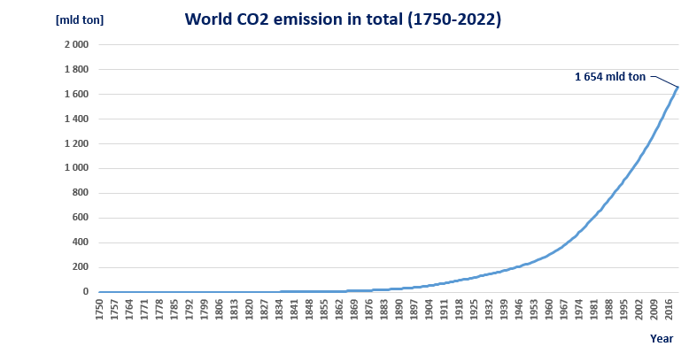
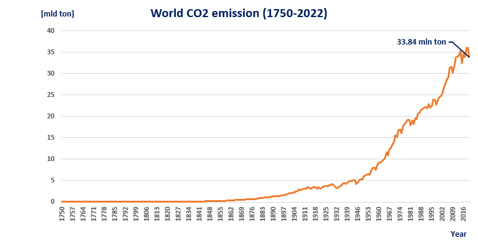
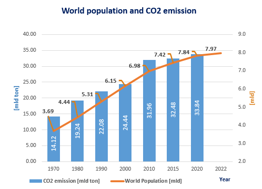
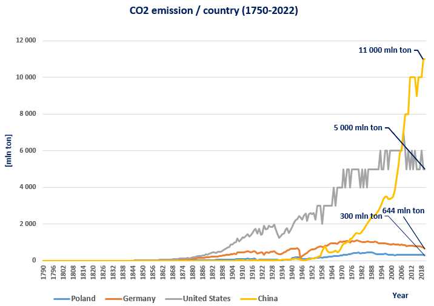
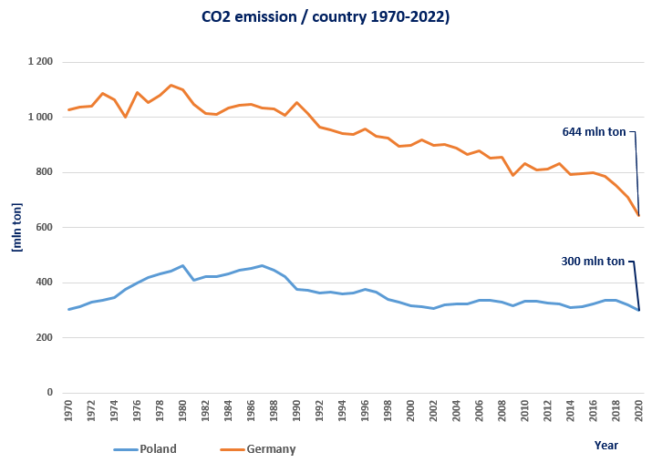
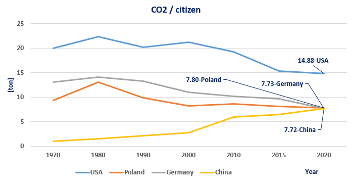

# CO2 emissions over the years

The project was created based on two separate datasets, which included data such as CO2 emissions grouped by country and world population. The goal of this project was to determine the trends in carbon dioxide emissions compared to the growth of the world population.

Links to datasets:

https://www.kaggle.com/datasets/moazzimalibhatti/co2-emission-by-countries-year-wise-17502022?resource=download
https://www.kaggle.com/datasets/iamsouravbanerjee/world-population-dataset?rvi=1

Extreme weather events and rising sea levels are just a few of the threats that can result from global warming, or more specifically, from greenhouse gases including CO2. That’s why monitoring carbon dioxide (CO2) emissions is so important for counteracting global disasters.

    
## **The following analyses include:**

•	World CO2 emissions for the years 1750-2022,

•	Comparison of world population and CO2 emissions,

•	Carbon dioxide emissions for chosen countries,

•	CO2 emissions per citizen for chosen countries.

## 1) World CO2 emissions for the years 1750-2022

The increase in world carbon dioxide emissions can be divided into two periods. The first period began at the end of the 19th century, while the second period occurred after the 1960s and continues to the present day. The global emission of CO2 since 1750 amounts to a total of 1 654 mld tons.

## 2) Comparison of world population and CO2 emissions

Carbon dioxide emissions have slowed since 2010, but they are still increasing by 2 mld tons every 10 years. The global population is also continuing to grow, making it challenging to reduce greenhouse gas emissions.

## 3) Carbon dioxide emissions for chosen countries

Based on CO2 emissions per country, there is no doubt that global industrial powers like the USA or China excel in carbon dioxide emissions compared to smaller countries like Poland or Germany (with emissions x10 to x22 times lower).

## 4) CO2 emissions per citizen for chosen countries

Based on information from the "CO2/citizen" chart, it is evident that while China excels in carbon dioxide emissions, when converting total CO2 emitted per citizen, there are no significant differences between Poland, Germany, and China. Moreover, American citizens use twice as much CO2 as citizens in the aforementioned countries.

Despite the fact that China does not stand out in terms of per capita CO2 production, there is an increasing trend in China's overall CO2 emissions, even on a per capita basis. Countries such as the USA, Poland, and Germany appear to recognize the importance of reducing greenhouse gases and are actively working towards the reduction of emissions. The data supports this observation.

**Further possible steps:**

We can analyze the sources of CO2. Subsequently, we can conduct public surveys asking, “What do you think about these source areas (which are closely related to the high volume of CO2 produced)?” This will help raise awareness about the dangers of global warming and the impact of human activities. We can also present relevant data to support our cause. Furthermore, we can spread this awareness in different countries and initiate a global movement.
